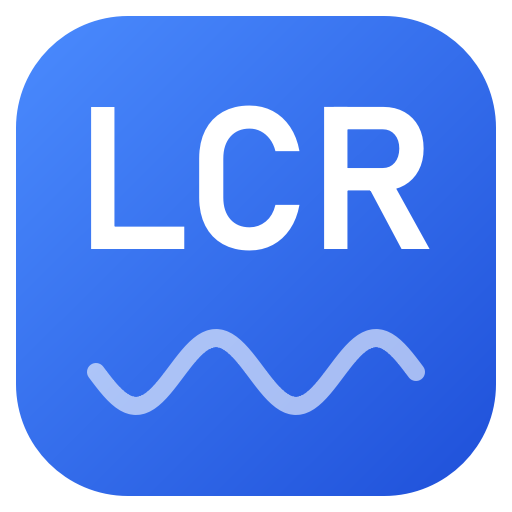
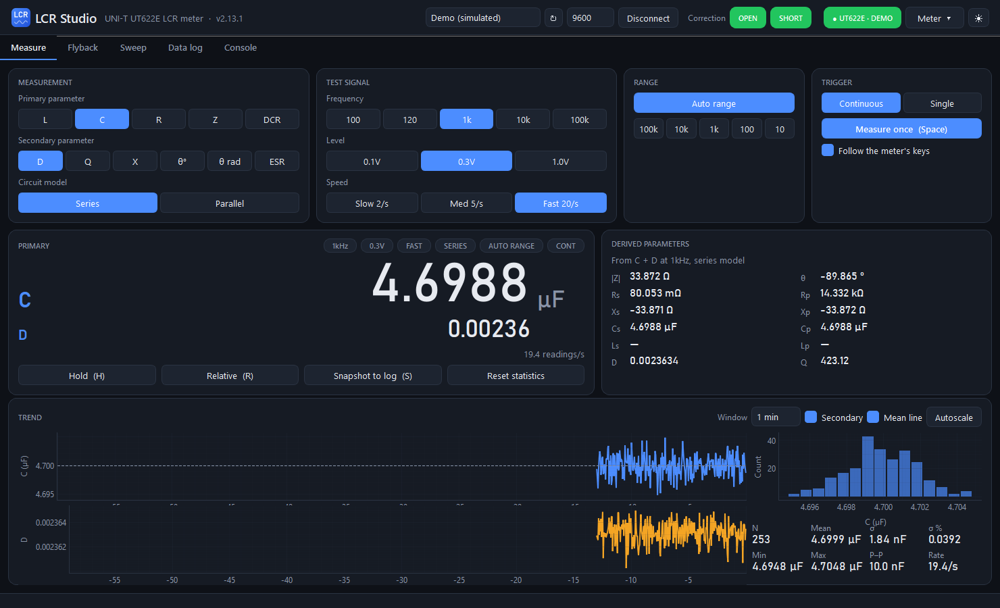
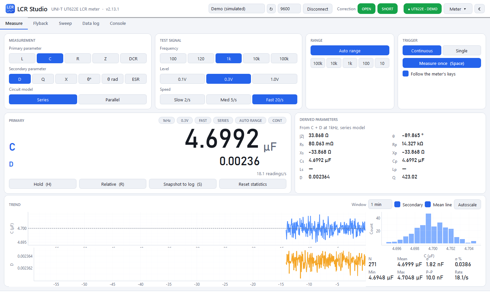
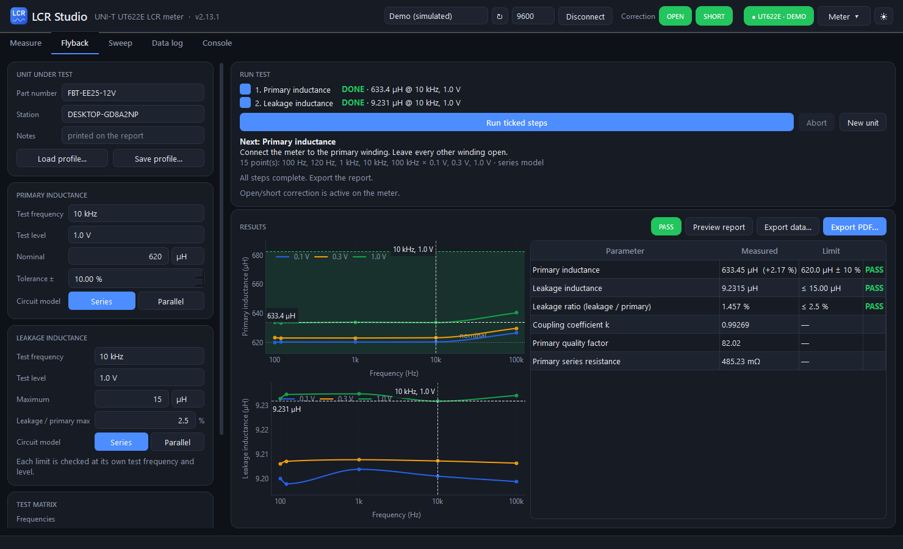
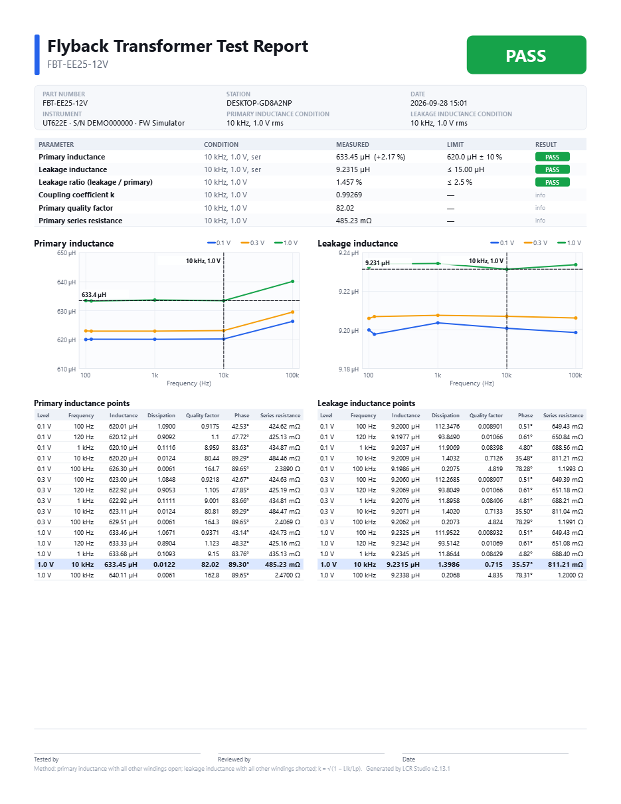
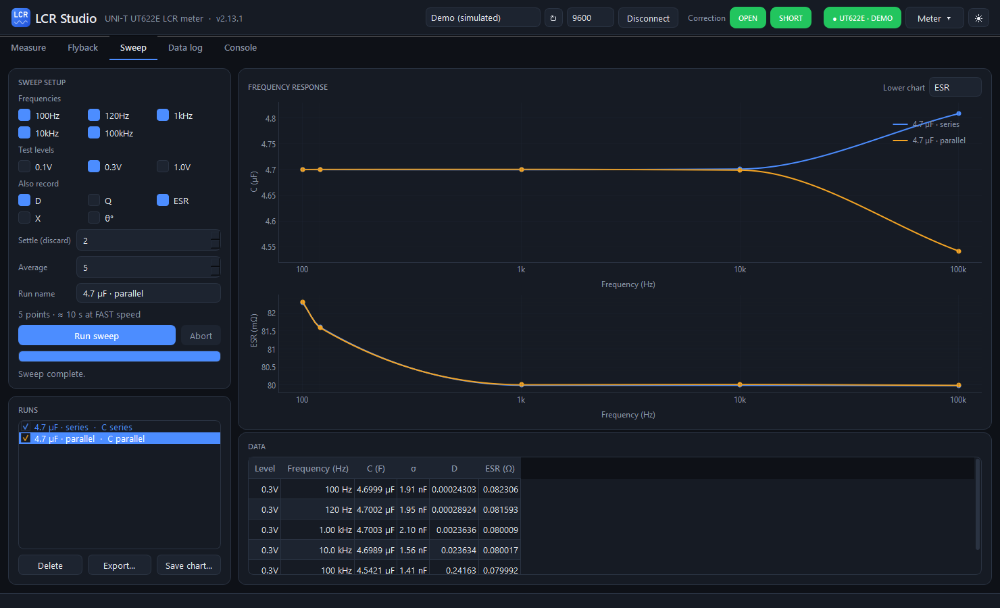
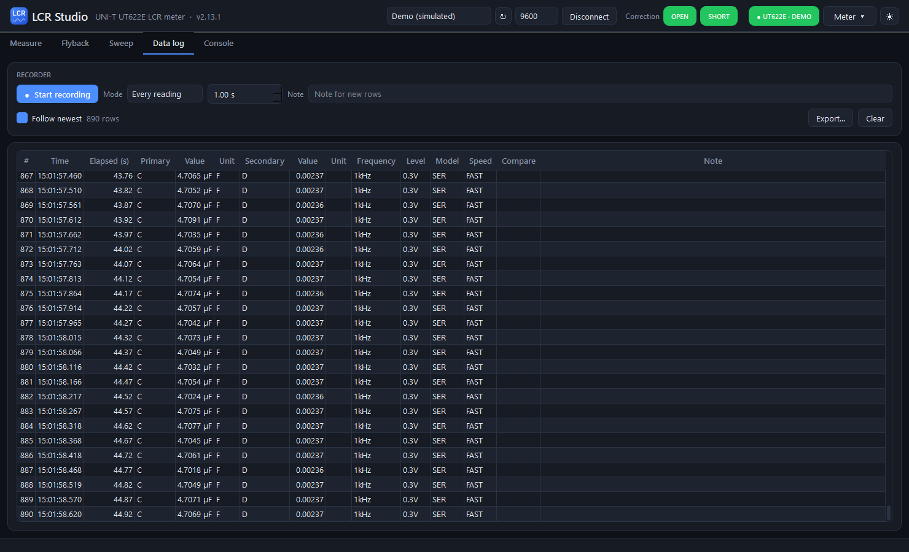
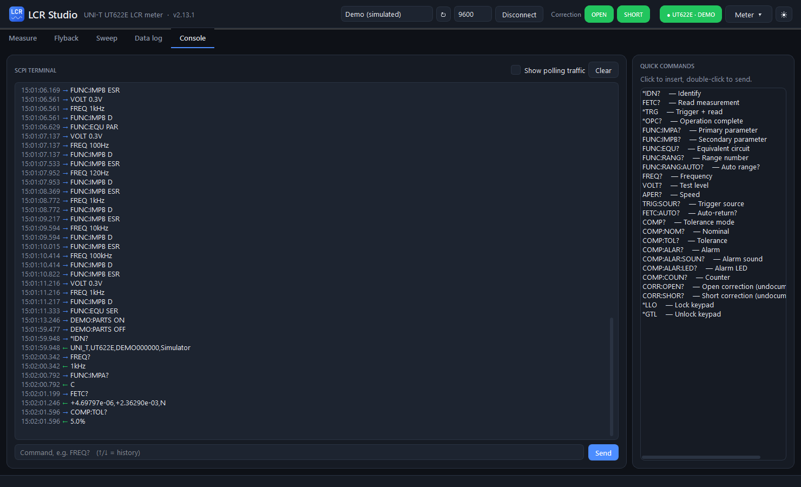

<div align="center">



# LCR Studio

**A modern desktop application for the UNI-T UT622E handheld LCR meter.**<br>
Live readout, **flyback transformer testing with one-page PDF reports**, equivalent-circuit analysis,<br>
frequency sweeps and data logging, all over the meter's USB cable.


[](LICENSE)
[](https://github.com/jvrpapa05/lcr-studio/releases/latest)
[](https://github.com/jvrpapa05/lcr-studio/actions/workflows/ci.yml)



</div>

---

## Why

The vendor software does the basics and little else. LCR Studio exposes **every remote function of the
meter** and adds the analysis you would normally reach for a spreadsheet for: series/parallel
conversion, ESR/Q/D/θ derivation, sweeps and statistics.

No NI-VISA, no drivers beyond the standard CH340 USB-serial driver.

## Download

Grab the latest build from the **[Releases page](../../releases/latest)**:

| Platform | File | Install |
|---|---|---|
| Windows 10 / 11 (x64) | `LCR-Studio-<version>-windows-x64.exe` | Portable, just run it. |
| Ubuntu 22.04+ / Debian 12+ / Mint 21+ (amd64) | `lcr-studio_<version>_amd64.deb` | `sudo apt install ./lcr-studio_<version>_amd64.deb` |

Connect the meter with its USB cable, **close the official UNI-T software** (only one program can own the
serial port), start LCR Studio, and it connects automatically.

> No meter at hand? Pick **Demo (simulated)** in the port list. A built-in simulator behaves like a real
> UT622E measuring a 4.7 µF capacitor, so every feature can be tried out.

## Features

### Live measurement

- Large readout with SI prefixes, overload (`OL`) detection and PASS/FAIL from the meter's comparator.
- **Hold** and **Relative** (Δ and Δ% against a captured reference).
- **Derived parameters**, calculated from every reading: |Z|, θ, Rs (ESR), Rp, Xs, Xp, Cs, Cp, Ls, Lp, D, Q.
- A rolling trend chart for the primary and secondary values (the meter's tolerance window is shaded while
  tolerance mode is on), a live histogram and statistics (mean, σ, σ %, min, max, p-p, rate).
- Every meter setting in a strip above the readout: L / C / R / Z / DCR, D / Q / X / θ° / θ rad / ESR,
  series / parallel model, 100 Hz – 100 kHz, 0.1 / 0.3 / 1.0 V, slow / medium / fast, auto or held range,
  continuous or single trigger. Changes made on the meter's own keys show up in the app within seconds.
- Port, baud rate, Connect and the open/short correction badges sit in the top bar, next to a **Meter** menu
  for the keypad lock and settings reset.

<table>
<tr>
<td width="50%"></td>
<td width="50%"></td>
</tr>
<tr>
<td align="center"><sub>Dark theme</sub></td>
<td align="center"><sub>Light theme, one click in the top bar</sub></td>
</tr>
</table>

### Flyback transformer test

An inductance test for flyback (and other multi-winding) transformers, producing a **one-page US Letter PDF
report** per unit. Tick the steps to run and press **Run ticked steps**. A pop-up shows the progress of each
step and, between steps, tells you how to rewire the part before continuing:

1. **Primary inductance:** meter on the primary, every other winding open.
2. **Leakage inductance:** meter on the primary, every other winding shorted.

Each step measures inductance and Q over every selected frequency × test level with its own circuit model,
and each limit is checked at its own test frequency and level: **primary nominal ± tolerance**, **leakage
maximum** and **leakage / primary maximum**. The results table adds the **coupling coefficient
k = √(1 − Llk/Lp)**, the primary Q and its series (or parallel) resistance. The charts draw one curve per
test level with the limits shown as a band and a line, switch to a log axis when a sweep spans more than a
decade, and mark the test point with a labelled cross-hair. Profiles save as JSON so a production line can
load a part in one click. Raw data exports to Excel with D, Q, phase and resistance for every point. The
report is identified by part number, test station (this computer's name) and date.



<table>
<tr>
<td width="46%"></td>
<td>

**The report** (vector PDF, US Letter) contains:

- a PASS / FAIL / INCOMPLETE verdict
- part number, test station, date, instrument identity and the test condition of each step
- a results table with conditions, limits and per-parameter results
- **primary inductance** and **leakage inductance vs frequency**, one curve per test level, with the
  test point marked
- every measured point of each step: inductance, dissipation, quality factor, phase and
  series resistance, with the test-condition row highlighted
- signature lines for tester and reviewer

</td>
</tr>
</table>

### Frequency & level sweeps

Characterise a part across 100 Hz – 100 kHz and all test levels. Each point captures the primary value plus
any of D, Q, ESR, X and θ, with configurable settle and averaging. Runs are overlaid for comparison and
exported to Excel, CSV or PNG. The meter's original settings are restored afterwards.



### Data logging

Record every reading, one per interval, or snapshots only (<kbd>S</kbd>). Each row carries a timestamp,
the full measurement context and your note. Export to Excel or CSV.



### SCPI console

A raw terminal with command history, quick-command list and a traffic monitor, for anything the UI doesn't
cover. The full command set is documented in [PROTOCOL.md](PROTOCOL.md).



### Keyboard shortcuts

| Key | Action |
|---|---|
| <kbd>Space</kbd> | Measure once (single trigger mode) |
| <kbd>H</kbd> | Hold the readout |
| <kbd>R</kbd> | Relative mode on/off |
| <kbd>S</kbd> | Snapshot the current reading into the data log |

## Supported hardware

| Meter | Status |
|---|---|
| UNI-T **UT622E** | Tested (firmware 1.3.2142) |
| UNI-T UT622A / UT622C | Same command set per the manual; unsupported functions (100 kHz, DCR) are ignored by the meter |

Link: CH340 USB-serial (VID `1a86`, PID `7523`), 9600 / 19200 / 38400 baud, 8N1, SCPI.

Not available over USB (do these on the meter): open/short correction, the meter's own recording mode,
and system settings (backlight, auto power-off). The app shows whether open/short correction is active.

## Linux notes

- The `.deb` installs a udev rule that gives the logged-in user access to the meter, so no `dialout`
  group changes are needed. Unplug and replug the meter once after installing.
- **Ubuntu / Mint:** the braille-display service `brltty` grabs CH340 devices and the port vanishes a second
  after plugging in. If you don't use a braille display, remove it:
  ```bash
  sudo apt remove brltty
  ```
- Running from source instead? Add yourself to the serial group once: `sudo usermod -aG dialout $USER`
  (then log out and back in).

## Run from source

Dependencies are locked with [uv](https://docs.astral.sh/uv/):

```bash
git clone https://github.com/jvrpapa05/lcr-studio.git
cd lcr-studio
uv sync              # creates .venv from uv.lock
uv run lcr-studio    # start the app
uv run pytest        # run the test suite (headless)
```

Linux needs the usual Qt runtime libraries (present on any desktop install; on minimal systems
`sudo apt install libxcb-cursor0 libxkbcommon-x11-0 libegl1`).

Build a package for the current OS:

```bash
uv sync --group build
uv run --group build python packaging/build.py     # -> dist/*.exe or dist/*.deb
```

Refresh the screenshots in this README (uses the simulator, no meter needed):

```bash
uv run python scripts/screenshots.py
```

## Development workflow

| Branch | Purpose | CI |
|---|---|---|
| `dev` | Day-to-day work | Tests on Windows and Ubuntu on every push |
| `main` | Releases | Tests, builds the `.exe` and `.deb`, smoke-tests both packages, publishes a GitHub release |

To ship a release: bump `__version__` in [`lcr_studio/__init__.py`](lcr_studio/__init__.py), merge `dev` into
`main`, push. The workflow tags `v<version>` and attaches both packages. Pushing to `main` without a version
bump still builds the packages (downloadable from the workflow run) but doesn't create a duplicate release.

## Project layout

```
lcr_studio/
  ut622e.py        meter driver (SCPI over pyserial) + simulator
  worker.py        background thread that owns the serial port
  engmath.py       SI formatting, impedance math
  theme.py         dark / light themes
  widgets.py       cards, badges, segmented buttons, unit fields, busy pop-up, chart helpers
  flyback.py       flyback test: profile, primary / leakage steps, measurement job, pass/fail evaluation
  report.py        one-page US Letter PDF report renderer
  panels/          one module per tab (measure, flyback, sweep, logger, console)
                   and controls (connection bar, settings strip, Meter menu)
  assets/          icon and bundled Barlow font
packaging/         PyInstaller build script, .desktop file, udev rule, icon
scripts/           screenshot generator
tests/             pytest suite (math, simulator, headless UI)
PROTOCOL.md        UT622E remote command reference
```

## License

LCR Studio is released under the [MIT License](LICENSE).

## Credits

- Readout font fallback: [Barlow](https://github.com/jpt/barlow) by Jeremy Tribby, SIL Open Font License 1.1.
- UI built with [PySide6](https://doc.qt.io/qtforpython/) and [pyqtgraph](https://www.pyqtgraph.org/).

LCR Studio is an independent project and is not affiliated with or endorsed by UNI-T (Uni-Trend Technology).
